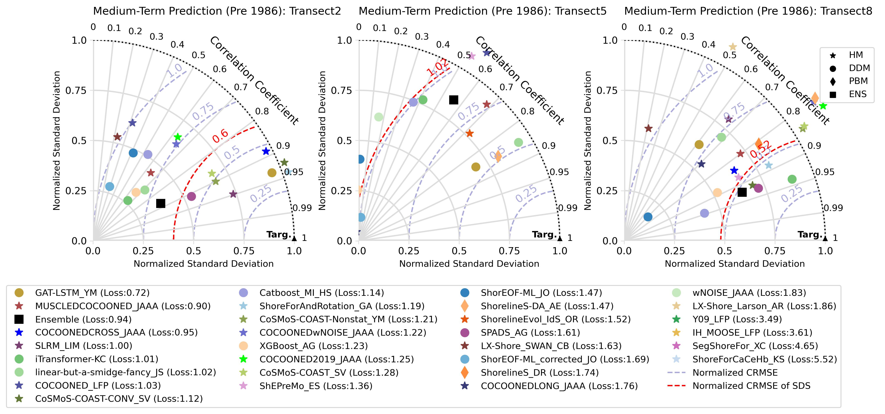
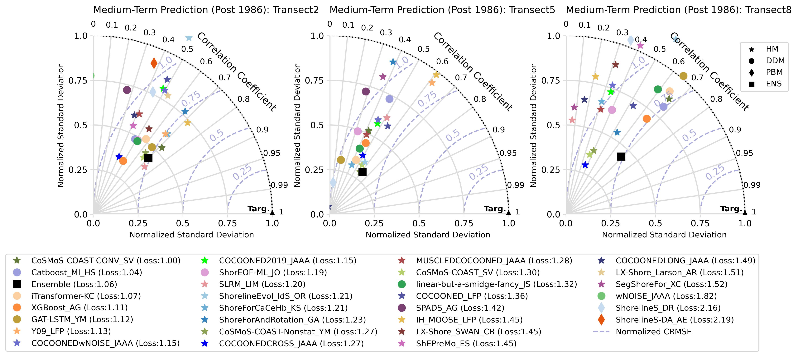
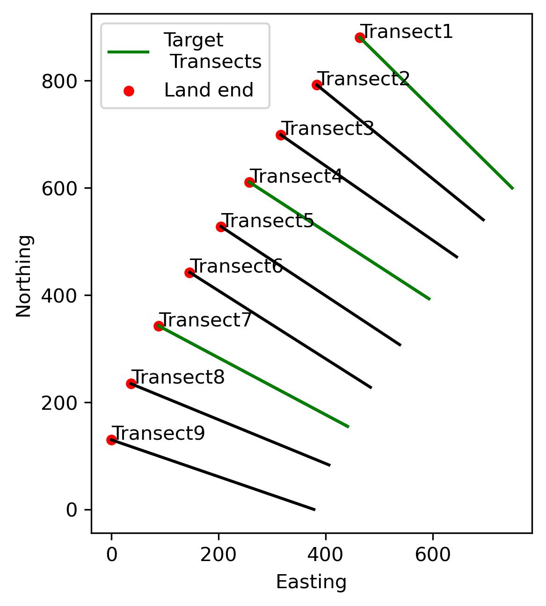
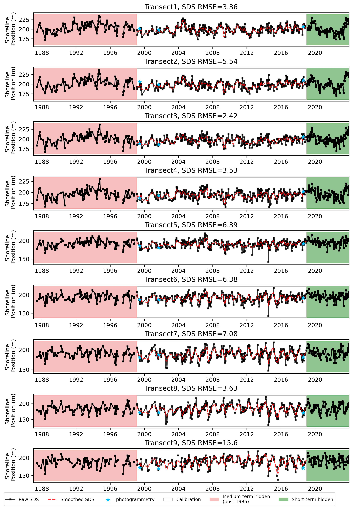
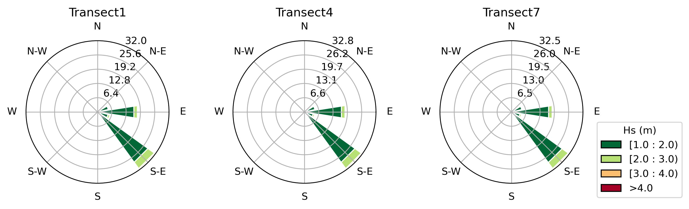
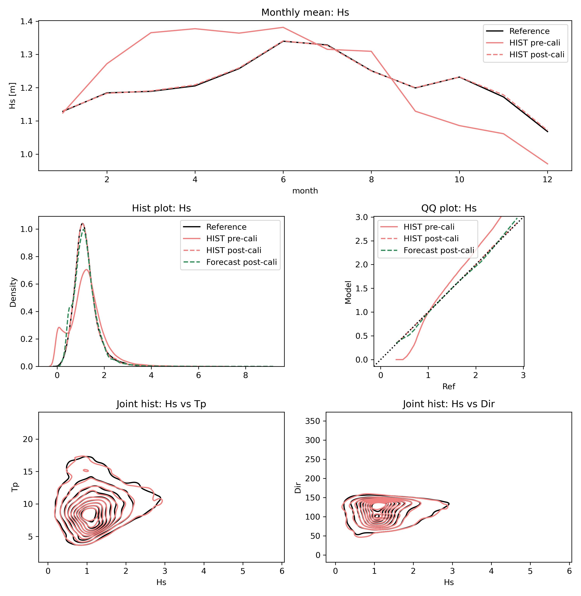
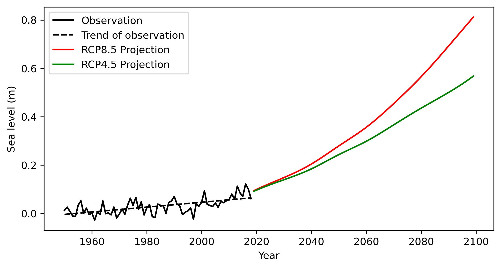

# ShoreShop 2.0: Advancements in Shoreline Change Prediction Models
This repository is a testbed for shoreline modelling algorithms. It contains all benchmark datasets, input files, codes, and results.
## ShoreShop 2.0 updates
:triangular_flag_on_post:**News** (2024.11) Additional datasets including `beach_profile`, `bathymetry`, `transect_coords (real)`, and `smoothed shorelines` have been released for model resubmission.Please refer to [Input data](#data) for details.

:triangular_flag_on_post:**News** (2024.11) Based on the discussion during the workshop, resubmission has been opened. All submissions after ShoreShop 2.0 should be placed in the resubmit folder. Please refer to [How to submit](#submit) for details.

:triangular_flag_on_post:**News** (2024.10) The ShoreShop 2.0 workshop was sucessfully held at WRL, Sydney, Australia from 28th Oct to 31st Oct. Leader board has been released.

## Leaderboard for initial submissions

## Background and Objectives 
### Background
Shoreline change prediction has witnessed the evolution of both hybrid and data-driven models, offering valuable insights into how coastlines respond to varying wave conditions across different timescales. Building on the success of the ShoreShop 1.0 ([Blind testing of shoreline evolution models](https://www.nature.com/articles/s41598-020-59018-y)) in 2018, which tested 19 shoreline models in predicting shoreline positions over a four-year period, ShoreShop 2.0 aims to further explore and showcase the evolution of predictive methods.
### Objectives
- **Diverse Methodology Showcase**: With the rapid advancements in data-driven models and the increasing availability of shoreline measurements, ShoreShop 2.0 intends to highlight the diversity of methods available for predicting shoreline changes.
- **Blind Testing Element**: Drawing inspiration from ShoreShop 1.0, ShoreShop 2.0 retains its core feature of blind testing to provide unbiased evaluations of the predictive models.
- **Key Focus Areas**:
  1. Assessing the performance of shoreline models using freely available datasets such as satellite-derived shorelines and modelled wave conditions.
  2. Evaluating the capabilities of shoreline models for short-term (5 years) and medium-term (50 years) predictions while discussing their potential for long-term predictions (80 years).
  3. Investigating the variability in shoreline model accuracy along the coastline of an embayed beach.

Join us at ShoreShop 2.0 to learn about the latest advancements, share insights, and foster collaborative efforts in shoreline change prediction.

### Notebooks

The following notebooks are available in this repo:
- [1.data_explore.ipynb](https://github.com/yongjingmao/ShoreModel_Benchmark/blob/main/1.data_explore.ipynb): explore the input transect, shoreline and wave data.
- [2.model_compare.ipynb](https://github.com/yongjingmao/ShoreModel_Benchmark/blob/main/2.model_compare.ipynb): compare and evaluate all the submitted model predictions against the target shoreline positions.

## Task description
### Beach_X
A real-world Beach_X serves as the target site for this workshop. To ensure a blind test, all geographical information regarding this beach has been intentionally removed. \
What we do know is that Beach_X is an east-facing embayed sandy beach with a mean grain size ***D50 ≈ 0.3 mm***. The depth of closure for this beach is 11 m and the corresponding slope of the active beach profile is about 0.022.\
9 shore-normal transects are established from North to South with a 100-meter longshore distance to measure shoreline position. The coordinates for the landward and seaward ends of transects are provided in `transects_coords.csv`.
These coordinates are in a local coordinate system, deliberately shifted (not distorted or rotated), and are expressed in easting (x) and northing (y) with a unit of meters. They do not reveal the actual geographical location of Beach_X.

### Tasks
Given 20 years shoreline position data in the 1999-2018 period, along with the shoreline position in 1951-05-01 as well as wave and sea level data spanning from 1940 to 2100, participants are tasked with:

- ***Task1.Short-term prediction***: Predict the shoreline position between **2019-01-01 and 2023-12-31** with **daily** timestep.
- ***Task2.Medium-term prediction***: Predict the shoreline position between **1951-05-01 and 1998-12-31** with **daily** timestep.
- ***Task3.Long-term prediction***: Predict the shoreline position between **2019-01-01 and 2100-12-31** with **daily** timestep (no evaluation).

### Evaluation
- **Target transects**: The target transects used for evaluation include ***Transects 2, 5 and 8*** in the North end, the middle and the South end of the beach respectively.
- **Target shorelines**: For each target transect, the model prediction will be evaluated against the observed shoreline data at target datetimes. The target datetimes for short-term and medium-term tasks are in `shorelines_target_short.csv` and `shorelines_target_medium.csv`. For blind testing, the observed shoreline data in the target window will be withheld for all participants. The long-term prediction will **not** be evaluated, and the results are only for discussion.
- **Evaluation metrics**: [Taylor diagram](https://en.wikipedia.org/wiki/Taylor_diagram) (consisting of centered root-mean-square error (CRMSE, bias excluded), Correlation and standard deviation (STD)) will be used to visualize and compare the model performance for each of the target transect.\
For quantitative comparison, root-mean-square error (RMSE, bias included), Correlation and STD are integrated into a single metrics. RMSE and STD of prediction are normalized by dividing them by the STD of the observation (target). This ensures that all three statistical parameters in the diagram are normalized. The loss function $\mathcal{L_i}$ is then defined by intergrating the three parameters for each target transect. The average loss across all target transects $\mathcal{L_avg}$ serves as the final metric for ranking the model performance. Please note that due to the difference between CRMSE and RMSE, the $\mathcal{L_i}$ is indicative of, but not identical to, the distance between the model points and the target point (the black triangle) in the Taylor diagram.
  
$$ RMSE_{norm} = \frac{RMSE_{pred}}{STD_{targ}},   STD_{norm} = \frac{STD_{pred}}{STD_{targ}}$$

$$ \mathcal{L_i} = \sqrt{(0-RMSE_{norm})^2+(1-Corr)^2+(1-STD_{norm})^2} $$
  
$$ \mathcal{L_avg} = \frac{1}{n} \sum_{i=1}^n \mathcal{L_i} $$

### Modeling rules
- Participants should not attempt to locate and retrieve extra shoreline information beyond that provided for Beach_X.
- Participants may use any type of model, including but not limited to hybrid and data-driven models.
- Participants must complete at least one task, although attempting both is encouraged.
- Participants must provide a brief description of the methodology used. 
- Code submission is optional.
- Each participant can have multiple submissions.

## Input data 
The following files are provided for shoreline predictions.
- `transects_coords.csv`: Coordinates for transects.
- `slope.csv`: Beach-face slope for transects.
- `shorelines_obs.csv`: Shoreline position between 1999 and 2018 for model calibration/training for each transect. 
- `shorelines_target_short.csv`: Target dates where short-term shoreline prediction will be evaluated.
- `shorelines_target_medium.csv`: Target dates where medium-term shoreline prediction will be evaluated. The shoreline position for 1951-05-01 is also provided as context for prediction.
- `Hindcast wave data (Hs.csv, Tp.csv, Dir.csv)`: Hindcast significant wave height, peak wave period and mean wave direction between 1940 and 2024 for each transect. Hindcast wave data can be used for short-term and medium-term shoreline modelling.
- `Forecast wave data (Hs.csv, Tp.csv, Dir.csv)`: Forecast (2006-2100) significant wave height, peak wave period and mean wave direction under RCP4.5 and 8.5 scenarios for each transect. Forecast wave data can be used for long-term shoreline modelling.
- `Tide data (tide.csv)`: Tidal height between 1950 and 2100 with daily interval. 
- `Sea level data (sealevel_obs.csv, sealevel_proj.csv)`: Annual mean of sea level between 1950 and 2100, including the gauge measurement (1950-2018) and the projections (2019-2100) under RCP4.5 and 8.5 scenarios.
  
The following constants are also provided.
- `Depth of wave data`: 10 (m)
- `Mean grain size D50`: 0.3 (mm)
- `Depth of closure`: 11 (m)
- `Slope of the active beach profile`: 0.022

### Shoreline
The shoreline data (`shorelines_obs.csv`) utilized in the ShoreShop 2.0 workshop is derived from public satellite images captured by Landsat 5, 7, 8, and 9 satellites. This data has been processed using [CoastSat](https://github.com/kvos/CoastSat), a public toolbox specifically designed for coastline analysis. \
The satellite-derived shoreline (SDS) data for model calibration/training starts from 1999 and ends at 2018 with 347 time steps. \
The shoreline position (m) is defined as the distance from the landward end of a transect to the intersection of the shoreline and the transect. \
All the shorelines have been corrected to reflect the instantaneous position at Mean Sea Level.\
The satellite-derived shoreline position data exhibits a high level of accuracy and closely aligns with the ground truth data for Beach_X with RMSE (shown in the figure below) less than 7 (m) for transects 1~8 and 15 (m) for transect 9 which is close to the headland, ensuring reliable model calibration and training.

For short-term shoreline prediction, The `shorelines_target_short.csv` contains the target dates from 2019 to 2023. All shoreline position values are intentionally withheld for all participants. During the evaluation phase, participants' predictions will be compared against the withheld shoreline position data from the SDS dataset.

For medium-term shoreline prediction, `shorelines_target_medium.csv` provides shoreline data for the date 1st May 1951, serving as the context data for the medium-term prediction task. Additional target dates are included for medium-term prediction. Participants' predictions will be evaluated against photogrammetry (pre-1989) and SDS (1989-1998) data available for the respective target dates.

### Hindcast wave data
The hindcast wave data used in this workshop was obtained by downscaling offshore directional wave spectra to nearshore areas.
The offshore wave data is from the [ERA5 Wave Hindcast](https://cds.climate.copernicus.eu/cdsapp#!/dataset/reanalysis-era5-single-levels?tab=overview). 
The [BinWaves](https://www.sciencedirect.com/science/article/pii/S1463500324000337) approach was applied to transform the offshore wave data to nearshore.
The significant wave height (Hs), peak wave period (Tp) and mean wave direction (Dir) were extracted along each shore-normal transect at 10 (m) depth contour with a daily interval from 1940 to 2023. Wave roses for the three target transects are shown below to demonstrate the minimal longshore variation of wave conditions.

### Forecast wave data
The forecast wave data were made using a nested WAVEWATCH III wave model with surface wind data from the Australian Community Climate and Earth System Simulator ([ACCESS](https://researchdata.edu.au/access1-0-climate-r2i1p1-ensemble/259215)) as inputs. Wave projections have been performed for medium range carbon (RCP4.5) and high range (RCP8.5) carbon emission scenarios throughout 2006-2100.
The offshore wave forecast was transformed to nearshore following the same approach applied to hindcast wave data.
For each transect, to ensure the consistency between the hindcast and forecast data, the forecast wave climates were calibrated to have the same seasonality and joint distribution of Hs, Tp and Dir over the period of 2006~2023 with the multivariate bias correction algorithm ([MBCn](https://link.springer.com/article/10.1007/s00382-017-3580-6)). Calibration results with hindcast data as reference for Transect1 under RCP4.5 scenario are shown below.

### Tide data
`tide.csv` contains the daily average of tidal height from [FES2014]([https://www.aviso.altimetry.fr/es/data/products/auxiliary-products/global-tide-fes/description-fes2014.html](https://www.aviso.altimetry.fr/en/index.php?id=1279&L=1)) model. Tidal components M2, S2, K1 and O1 were used for reconstruction. Tidal height is **the same for all transects**.

### Sea level data
`sealevel_obs.csv` contains the annual sea level data from gauge measurement (1950-2018). `sealevel_proj.csv` contains the sea level projection under the RCP 4.5 and 8.5 scenarios (2019-2100). 
The projection data is from NASA's [SEA LEVEL PROJECTION TOOL](https://sealevel.nasa.gov/ipcc-ar6-sea-level-projection-tool), which is based on the regional sea level projections provided in the IPCC 6th Assessment Report (AR6). Sea level is **the same for all transects**.

### Bathymetry and slope data
Similar to the vast majority of beaches worldwide, Beach_X does not have nearshore bathymetry data available. Instead, `slope.csv` contains the beach-face slope for each transect derived from SDS with the [CoastSat.slope](https://github.com/kvos/CoastSat.slope) tool. Therefore, participants are challenged to adapt their models accordingly to address the model applicability under data poor scenarios with only freely accessible datasets.

## Outputs and Deliverables

Participants should provide short-term, medium-term and long-term model predictions for **all transects** as `shorelines_prediction_short.csv`, `shorelines_prediction_medium.csv`, and `shorelines_prediction_long.csv`.\
Both the short-term and medium-term model predictions should have **daily interval**. For models that do not generate daily outputs, please interpolate the results to daily.\
All prediction submissions should be placed in the designated submission folder.
The submission folder will have shoreline predictions from various participants.
An illustrative example of submission is provided in the `submissions/ShoreFor` folder for reference. 

## Model classification

Participants should copy and check the boxes below in the model description to assist in classifying the submitted model. An example of a model description can be found [here](https://github.com/yongjingmao/ShoreModel_Benchmark/blob/main/submissions/ShoreFor/README.md).

#### Model mechanics
- [ ] Process-Based Models (PBM): couple hydrodynamics, waves, and morphodynamics through mass and momentum conservation laws.
- [ ] Hybrid Models (HM): use observational data to calibrate free parameters in the equilibrium configuration of a system.
- [ ] Data-Driven Models (DDM): use observational data to train regression models (e.g. machine learning and statistical models).
#### Model elements (multiple choice)
- [ ] Cross-shore: model the shoreline position for each transect independently.
- [ ] Long-shore: incorporate the interaction of shoreline position across different transects.
- [ ] Sea level: consider the impact of sea level rise on shoreline position.
 

## How to submit (Resubmission after ShoreShop2.0)

To submit your results, please:

1. [fork](https://github.com/yongjingmao/ShoreModel_Benchmark/fork) this repository;
   - Begin by forking the original workshop repository to your GitHub account.
2. Create a Submission Folder:
   - Inside the resubmission folder, create a subfolder named **"ModelName_AuthorInitials"**. Replace ModelName with the name of your model and AuthorInitials with your initials.
3. Place Your Prediction Files:
   - Copy your completed prediction files (`shorelines_prediction_short.csv`, `shorelines_prediction_medium.csv` and/or `shorelines_prediction_long.csv`) into the subfolder created in Step 2.
4. Provide Your Model Description (an example is [here](https://github.com/yongjingmao/ShoreModel_Benchmark/blob/main/submissions/ShoreFor/README.md)):
   - Include a README.md file providing a clear description of the model you used.
   - Copy and complete the model classification checkboxes to the README.md.
5. Include Your Code (Optional):
   - Create another subfolder within the algorithm folder named ModelName_AuthorInitials.
   - Copy your commented code into this subfolder.
   - Include a README.md file providing clear instructions on how to run your code to reproduce the prediction outputs.
6. Submit Your Results:
   - Create a [Pull request](https://docs.github.com/en/pull-requests/collaborating-with-pull-requests/proposing-changes-to-your-work-with-pull-requests/creating-a-pull-request-from-a-fork) to the original workshop repository to submit your prediction results and optional code.

If you need any help with this submission, please post on the [GitHub Issues](https://github.com/yongjingmao/ShoreModel_Benchmark/issues) page.

### Deadline

The deadline for the resubmission is **17/Dec/2024**.

## Questions and Comments

Please put any questions on the [GitHub Issues](https://github.com/yongjingmao/ShoreModel_Benchmark/issues) page so that everybody can read/comment.

## Acknowledgements

We extend our gratitude to Dr. Killian Vos, Dr. Laura Cagigal and Dr. Raimundo Ibaceta for generously sharing the CoastSat, BinWaves and ShoreFor codes, as well as to Aditya Deshmukh for supplying the forecast wave data.
