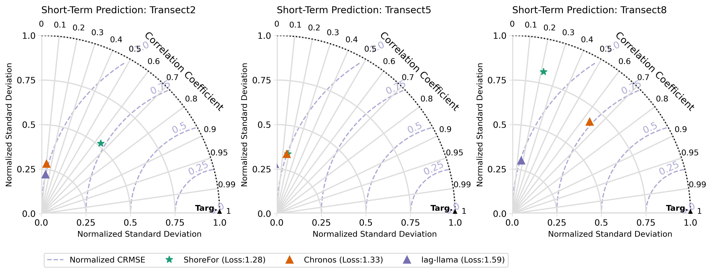

# ShoreShop 2.0: Advancements in Shoreline Change Prediction Models
This repository is a testbed for shoreline modeling algorithms. It contains all benchmark datasets, input files, evaluation codes and evaluation results.

## Background and Objectives
### Background
Shoreline change prediction has witnessed the evolution of both hybrid and data-driven models, offering valuable insights into how coastlines respond to varying wave conditions across different timescales. Building on the success of the ShoreShop 1.0 ([Blind testing of shoreline evolution models](https://www.nature.com/articles/s41598-020-59018-y)) in 2018, which rigorously tested 19 shoreline models in predicting shoreline positions over a four-year period, ShoreShop 2.0 aims to further explore and showcase the evolution of predictive methods.
### Objectives
- **Diverse Methodology Showcase**: With the rapid advancements in data-driven models and the increasing availability of shoreline measurements, ShoreShop 2.0 intends to highlight the diversity of methods available for predicting shoreline changes.
- **Blind Testing Element**: Drawing inspiration from ShoreShop 1.0, ShoreShop 2.0 retains its core feature of blind testing to provide unbiased evaluations of the predictive models.
- **Key Focus Areas**:
  1. Assessing the performance of shoreline models using freely available datasets such as satellite-derived shorelines and modelled wave conditions.
  2. Evaluating the capabilities of shoreline models for both short-term (5 years) and long-term (35 years) predictions.
  3. Investigating the variability in shoreline model accuracy along the coastlines of a embayed beach.

Join us at ShoreShop 2.0 to delve deeper into the latest advancements, share insights, and foster collaborative efforts in the field of shoreline change prediction.

### Notebooks

The following notebooks are available in this repo:
- [1.data_explore.ipynb](https://github.com/yongjingmao/ShoreModel_Benchmark/blob/main/1.data_explore.ipynb): explore the input transect, shoreline and wave data.
- [2.model_compare.ipynb](https://github.com/yongjingmao/ShoreModel_Benchmark/blob/main/2.model_compare.ipynb): compare and evaluate all the submitted model predictions against the target shoreline positions.

## Task description
### Beach_X
A real-world Beach_X serves as the target site for this workshop. To ensure a blind test, all geographical information regarding this beach has been intentionally removed. \
What we do know is that Beach_X is an east-facing embayed sandy beach with the mean grain size ***D50 ≈ 0.3 mm***.\
9 shore-normal transects are established from North to South with a 100-meter longshore distance to measure shoreline position. The coordinates for the landward and seaward ends of transects are provided in `transects_coords.csv`.
These coordinates are in a local coordinate system, deliberately shifted (not distorted or rotated), and are expressed in easting (x) and northing (y) with a unit of meters. They do not reveal the actual geographical location of Beach_X.

### Tasks
Given the shoreline position data in the 1987-2018 period, along with the shoreline position in 1950 and wave data spanning from 1950 to 2024, participants are tasked with:

- ***Task1.Short-term prediction***: Predict the shoreline position at target datetimes between **2019-01-01 and 2023-12-31** with **daily** timestep.
- ***Task2.Long-term prediction***: Predict the shoreline position at target datetimes between **1951-01-05 and 1986-12-31** with **daily** timestep.

### Evaluation
- **Target transects**: The target transects used for evaluation include ***Transects 2, 5 and 8*** in the North end, the middle and the South end of the beach respectively.
- **Target shorelines**: For each of the target transects, the model prediction will be evaluated against the observed shoreline data at target datetimes. The target datetimes for short-term and long-term tasks are in `shorelines_target_short.csv` and `shorelines_target_long.csv`. For blind testing, the observed shoreline data in the target window will be withheld for all participants.
- **Evaluation metrics**: [Taylor diagram](https://en.wikipedia.org/wiki/Taylor_diagram) (consisting root-mean-square-error (RMSE), Correlation and standard deviation (STD)) will be used to visualize and compare the model performance for each of the target transect.\
RMSE and STD of prediction are normalized by dividing them by the STD of the observation (target). This ensures that all three statistical parameters in the diagram fall within the range of [0, 1]. The distance $Dist_{i}$ between the model points and the target point (the black triangle) in the Taylor diagram is calculated for each target transect. The average of the distance across all target transects $Dist_{avg}$ serves as the final metric for ranking the model performance. A smaller distance indicates better model performance.
  
$$ RMSE_{norm} = \frac{RMSE_{pred}}{STD_{targ}},   STD_{norm} = \frac{STD_{pred}}{STD_{targ}}$$

$$ Dist_i = \sqrt{(0-RMSE_{norm})^2+(1-Corr)^2+(1-STD_{norm})^2} $$
  
$$ Dist_{avg} = \frac{1}{n} \sum_{i=1}^n Dist_i $$
  
  

### Modeling rules
- Participants should not attempt to locate and retrieve extra shoreline information beyond provided for Beach_X.
- Participants may use any type of model including but not limited to hydrid and data-driven models.
- Participants must complete at least one task, although attempting both is encouraged.
- Participants must provide a brief description of the methodology used. 
- Code submission is optional.

## Input data
The following files are provided for shoreline prediction.
- `shorelines_obs.csv`: Shoreline position between 1987 and 2018 for model calibration/training for each transect. 
- `shorelines_target_short.csv`: Target dates where short-term shoreline prediction will be evaluated.
- `shorelines_target_long.csv`: Target dates were long-term shoreline prediction will be evaluated. Shoreline position for 1950 is also provided as context for prediction.
- `Wave data (Hs.csv, Tp.csv, Dp.csv)`: Hindcast significant wave height, peak wave period and peak wave direction between 1950 and 2024 for each transect.
The following constants are also provided.
- `Depth of wave data`: 10 (m)
- `Mean grain size D50`: 0.3 (mm)

### Shoreline
The shoreline data (`shorelines_obs.csv`) utilized in the ShoreShop 2.0 workshop is derived from public satellite images captured by Landsat 5, 7, 8, and 9 satellites. This data has been processed using [CoastSat](https://github.com/kvos/CoastSat), a public toolbox specifically designed for coastline analysis. \
The satellite derived shoreline (SDS) data for model calibration/training starts from 1987 and ends at 2018 with 455 time steps. \
The shoreline position (m) is defined as the distance between the landward end of a transect to the intersection of the shoreline and the transect. \
All the shorelines have been corrected to reflect the instaneous position at Mean Sea Level.\
The satellite-derived shoreline position data exhibits a high level of accuracy and closely aligns with the ground truth data for Beach_X, ensuring reliable model calibration and training.\

For short-term shoreline prediction, The `shorelines_target_short.csv` contains the target dates from 2019 to 2023 for short-term shoreline prediction. All shoreline position values are intentionally withheld for all participants. During the evaluation phase, participants' predictions will be compared against the withheld shoreline position data sourced from the same dataset used for calibration and training.

For long-term shoreline prediction, `shorelines_target_long.csv` provides shoreline data for the date 5th January 1951, serving as the context data for the long-term prediction task. Additional target dates are included for long-term prediction. For evaluation, participants' predictions will be compared against ground photogrammetry data available for the respective target dates.

### Wave data
The nearshore wave data used in this workshop was obtained by downscaling offshore directional wave spectra to nearshore areas.
The offshore wave data is from the [CAWCR Wave Hindcast](https://data.csiro.au/collection/csiro:39819) produced by CSIRO. 
The [BinWaves](https://www.sciencedirect.com/science/article/pii/S1463500324000337) approach was applied for wave downscaling.
The significant wave height (Hs), peak wave period (Tp) and peak wave direction (Dp) were extracted along each shore-normal transect at 10 (m) depth contour with daily interval from 1979 to 2023.

## Outputs and Deliverables

Participants should provide short-term and long-term model predictions for **all transects** as `shorelines_prediction_short.csv` and `shorelines_prediction_long.csv`.\
Both the short-term and long-term model predictions should have **daily interval**. For models which do not generate daily outputs, please interpolate the results to daily.\
All prediction submissions should be placed in the designated submission folder.
The submission folder will have shoreline predictions from various participants.
Three illustrative examples of submission are provided in the submission folder for reference. ShoreFor model completes both short and long-term prediction tasks. [Chronos](https://github.com/amazon-science/chronos-forecasting) and [Lag-LLama](https://github.com/time-series-foundation-models/lag-llama) are the two benchmarks from LLM models which do not have long-term prediction capability.

## How to submit

To submit your results, please:

1. [fork](https://github.com/yongjingmao/ShoreModel_Benchmark/fork) this repository;
   - Begin by forking the original workshop repository to your GitHub account.
2. Create a Submission Folder:
   - Inside the submission folder, create a subfolder named ModelName_AuthorInitials. Replace ModelName with the name of your model and AuthorInitials with your initials.
3. Place Your Prediction Files:
   - Copy your completed prediction files (shorelines_prediction_short.csv and/or shorelines_prediction_long.csv) into the subfolder created in Step 2.
4. Include Your Code (Optional):
   - Create another subfolder within the algorithm folder named ModelName_AuthorInitials.
   - Copy your commented code into this subfolder.
   - Include a README.md file providing clear instructions on how to run your code to reproduce the prediction outputs.
5. Submit Your Results:
   - Create a [Pull request](https://docs.github.com/en/pull-requests/collaborating-with-pull-requests/proposing-changes-to-your-work-with-pull-requests/creating-a-pull-request-from-a-fork) to the original workshop repository to submit your prediction results and optional code.

If you need any help with this submission, please post in the [GitHub Issues](https://github.com/yongjingmao/ShoreModel_Benchmark/issues) page.

### Deadline

The deadline for this first round of analysis is the end of the year (**01/10/2024**).

## Questions and Comments

Please put any questions on the [GitHub Issues](https://github.com/yongjingmao/ShoreModel_Benchmark/issues) page so that everybody can read/comment.

## Acknowledgements

We acknowledge the Killian Vos and Laura Cagigal for sharing the CoastSat and BinWaves codes.
