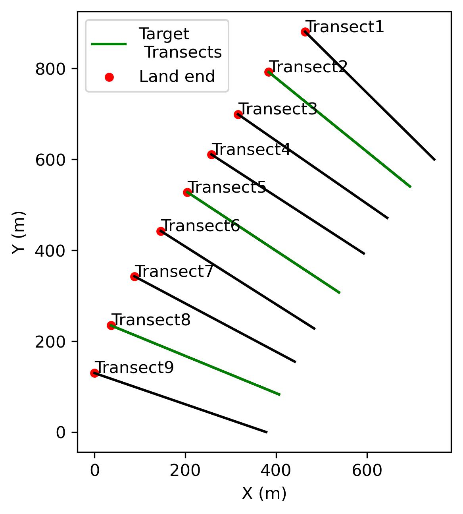

# Shoreshop_Benchmark
This repository is a testbed for shoreline modeling algorithms. It contains all benchmark datasets, input files, evaluation codes and evaluation results.

## Background and Objectives
Both hybrid and data-driven models have been developed to predict the shoreline change in response to waves conditions at different temporal scales. 
The first ShoreShop 1.0 ([Blind testing of shoreline evolution models](https://www.nature.com/articles/s41598-020-59018-y)) in 2018 blindly tested 19 shoreline models to predict shoreline position in four-years' period.
Standing on the succuss of the ShoreShop 1.0 and considering the fast development of data-driven models and the surge of shoreline measurements, in the ShoreShop 2.0, we want to showcase the diversity of different methods that can be used to predict the shoreline change.
By incorporating the core features of ShoreShop1.0, especially the blind test element, the ShoreShop 2.0 also aims at understanding:
1. The applicability of shoreline models given cost-free datasets (e.g. satellite-derived shorelines and hindcasts of waves).
2. The potential of shoreline models for long-term (i.e. 50 years) in addition to short-term (i.e. 5 years) prediction.
3. The longshore variance of shoreline model accuracy.

### Notebooks

The following notebooks are available in this repo:
- [1.data_explore.ipynb](https://github.com/yongjingmao/ShoreModel_Benchmark/blob/main/1.data_explore.ipynb): explore the input transect, shoreline and wave data.
- [2.model_compare.ipynb](https://github.com/yongjingmao/ShoreModel_Benchmark/blob/main/2.model_compare.ipynb): compare and evaluate all the submitted model predictions against the shoreline position (unreleased).

## Task description
### Beach_X
The target site in this workshop is a real beach (Beach_X) in the world. But for the purpose of blind test, we wiped out the geographical information about this site.\
The only information we know is that this is a east-facing sandy beach. The mean grain size ***D50 ≈ 0.3 mm***.\
9 shore-normal transects are defined from North to South with 100 m longshore distance to quantify the shoreline position. The coordinates for the landward and seaward ends of transects are provided in `transects_coords.csv`.
The coords in this file were originally in local coordinate system and intentionally shifted but not distorted nor rotated, so these coords are still in easting and northing with unit of meter but they do not tell the location of the beach in the real world.

### Tasks
Given the shoreline position data in 1950 and in the 1987-2018 period and as well as the wave data in the 1950-2024 period, this workshop includes two tasks:

- ***Task1.Short-term prediction***: Predict shoreline position at the target datetimes between 2018 and 2024 with timestep about two-weeks.
- ***Task2.Long-term prediction***: Predict shoreline position at the target dateimtes between 1950 and 1987 with timestep about 10 years interval.

### Modeling rules
- Participants should not attempt to locate and retrieve the target shoreline data for Beach_X.
- Participants may use any type of model including but not limited to hydrid and data-driven models.
- Participants need to complete at least 1 task but it is encouraged to attempt both two tasks.
- Participants must provide a short description to the method used. 
- It is optional to submit the codes for the methods used.

### Evaluation
The target transects used for evaluation include Transects 1, 4 and 7 in the North end, the middle and the South end of the beach respectively.\
For each of these transects, the model prediction will be evaluated against the hidden shoreline data at target datetimes. \
[Taylor diagram](https://en.wikipedia.org/wiki/Taylor_diagram) (consisting NMSE, Correlation and STD) will be used to visualize and compare the model performance for each of the target transect.\
 ***(What is the exat scoring metrics? Need a discussion.)***

## Input data
The following files are provided for shoreline prediction.
- `shorelines_obs.csv`: Shoreline position between 1987 and 2018 for model calibration/training for each transect. 
- `shorelines_target_short.csv`: Target dates of short-term shoreline prediction, shoreline position values need to be filled with model prediction.
- `shorelines_target_long.csv`: Target dates of long-term shoreline prediction including the shoreline position for 1950, other missing shoreline position values need to be filled with model prediction.
- `Wave data (Hs.csv, Tp.csv, Dp.csv)`: Hindcast significant wave height, peak wave period and peak wave direction between 1979 and 2024 for each transect.
The following constants are also provided.
- `Depth of wave data`: 10 (m)
- `Mean grain size D50`: 0.3 (mm)

### Shoreline
The Shoreline data in `shorelines_obs.csv` used in this workshop is derived from publich satellite (Landsat 5, 7, 8&9) images with [CoastSat](https://github.com/kvos/CoastSat) — a public toolbox. \
The satellite derived shoreline (SDS) data for model calibration/training starts from 1987 and ends at 2018 with 455 time steps. \
The shoreline position (m) is defined as the distance between the landward end of a transect to the intersection of the shoreline and the transect. \
The first colum shows the time of the record. Columns 2 to 10 are the shoreline position for each trasect respectively.

Satellite derived shoreline position data matches the ground truth data in the Beach_X very well.

For short-term shoreline prediction, The `shorelines_target_short.csv` contains the target dates from 2019 to 2023 for short-term shoreline prediction. All the shoreline position values are wiped out and will not be released before receiving all submissions. Participants need to fill these misssing values based on model results. In the evaluation stage, the predictions will be compared against the shoreline position data from the same source as the data used for calibration/training.

For long-term shoreline prediction, `shorelines_target_long.csv` contains the shoreline data for 5/Jan/1951 as the context for long-term prediction. The shoreline data in other target dates need to be filled with the long-term shoreline prediction. In the evaluation stage, the predictions will be compared against the groud photogrammetry data at the target dates.

### Wave data
The nearshore wave data used in this workshop was obtained by downscaling offshore directional wave spectra to nearshore areas.
The offshore wave data is from the [CAWCR Wave Hindcast](https://data.csiro.au/collection/csiro:39819) produced by CSIRO. 
The [BinWaves](https://www.sciencedirect.com/science/article/pii/S1463500324000337) was applied for wave downscaling.
The significant wave height (Hs), peak wave period (Tp) and peak wave direction (Dp) were extracted along each shore-normal transect at 10 (m) depth contour with daily interval from 1979 to 2023.

## Outputs and Deliverables

Participants should fill the missing values in the `shorelines_target_short.csv` and/or the `shorelines_target_long.csv` and rename these two files as:\
`shorelines_target_short.csv`-->`shorelines_prediction_short.csv` and\
`shorelines_target_long.csv`-->`shorelines_prediction_long.csv`.\
The `submission` folder will contain the shoreline predictions from the different participants. An example of submission is provided in the `ShoreFor` folder. 

## How to submit

To submit your results, please:
(steps 4&5 are optional for participants to share the codes)

1. [fork](https://github.com/yongjingmao/ShoreModel_Benchmark/fork) this repository;
2. Create a subfolder in the submission folder and name as 'ModelName_AuthorInitials';
3. Copy `shorelines_prediction_short.csv` and/or `shorelines_prediction_long.csv` into the created folder in step 2;
4. Create a subfolder in the algorithm folder and name as 'ModelName_AuthorInitials';
5. Copy your commented code as well as a README.md with instructions on how to run the code to reproduce the outputs into the created folder in step 4 \;
6. Create a [Pull request](https://docs.github.com/en/pull-requests/collaborating-with-pull-requests/proposing-changes-to-your-work-with-pull-requests/creating-a-pull-request-from-a-fork) to the original repository to submit your results.

If you need any help with this submission, please post in the [GitHub Issues](https://github.com/yongjingmao/ShoreModel_Benchmark/issues) page.

### Deadline

The deadline for this first round of analysis is the end of the year (**01/10/2024**).

## Questions and Comments

Please put any questions on the [GitHub Issues](https://github.com/yongjingmao/ShoreModel_Benchmark/issues) page so that everybody can read/comment.

## Acknowledgements

We acknowledge the Killian Vos and Laura Cagigal for sharing the CoastSat and BinWaves codes.
We also ac' creators of this repository which was used as a template: https://github.com/gwmodeling/challenge
