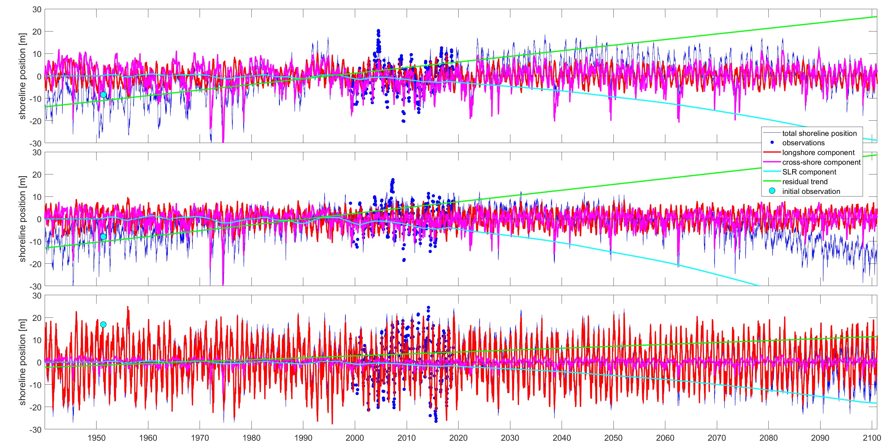

## CoSMoS-COAST-CONV model
### Model description
CoSMoS-COAST is a large-scale, long-term shoreline model integrating longshore and cross-shore transport, presented in Vitousek et al. 2017 [[1](https://doi.org/10.1002/2016JF004065)], 2021 [[2](https://doi.org/10.1029/2019JF005506)], 2023 [[3](https://doi.org/10.1029/2022JF006936)].  The model presented in this particular submission (called "COSMOS-COAST-CONV") is an experimental, convolution-based version of the full CoSMoS-COAST model [[4](https://doi.org/10.5066/P95T9188)]. The manner in which the model uses discrete convolution operations to produce predictions of shoreline change will be described in an upcoming manuscript. 

The experimental COSMOS-COAST-CONV model uses the same, well-known CoSMoS-COAST model governing equation, which is given by:

$$ \frac{dY}{dt}=-\frac{1}{D_c} \frac{dQ}{dx}+\frac{Y_{\mathrm{eq}}-Y}{\tau}-\frac{c}{\tan\beta}\frac{dS}{dt}+v_{\mathrm{lt}} $$

where $$\frac{dY}{dt}$$ is the rate of change in the shoreline position $$Y$$, and the terms on the right-hand side represent (1) longshore transport, (2) wave-driven cross-shore (after Yates et al., 2009 [[5](https://agupubs.onlinelibrary.wiley.com/doi/pdf/10.1029/2009JC005359)] and Vitousek et al. 2021 [[2](https://doi.org/10.1029/2019JF005506)]), (3) sea-level driven profile recession (i.e., the "Bruun rule"), and (4) a residual (linear) trend, respectively.  See references [[1](https://doi.org/10.1002/2016JF004065)], [[2](https://doi.org/10.1029/2019JF005506)], & [[3](https://doi.org/10.1029/2022JF006936)] for details on each model component.  An example of the dynamics of each shoreline component is shown in the figure below.

### Model implementation
The code of the experimental CoSMoS-COAST-CONV model is included with the submission.  

The model was applied to ***Task1.Short-term prediction***, ***Task2.Medium-term prediction***, and ***Task3.Long-term prediction***. For each transects individually, the model parameters were calibrated using wave ($H_s$, $T_p$, $\theta$) and smoothed shoreline data from 1940 to 2018 with a daily time step.  The calibrated model was then used to predict shoreline positions from 1940 to 2100, with given wave conditions.

The current, experimental model is calibrated using a constrained optimization routine ("fmincon" in Matlab and not the ensemble Kalman filter method of the published model) that minimizes the loss function  

$$ \mathcal{L_i} = \sqrt{(0-RMSE_{\mathrm{norm}})^2+(1-Corr)^2+(1-STD_{\mathrm{norm}})^2} $$

for each transect $$i$$, individually, where $$RMSE_{\mathrm{norm}} = \frac{RMSE_{\mathrm{pred}}}{STD_{\mathrm{targ}}}$$, $$STD_{\mathrm{norm}} = \frac{STD_{\mathrm{pred}}}{STD_{\mathrm{targ}}}$$, and 
$$Corr$$ are the normalized root mean square error, the normalized standard deviation, and the correlation coefficient, respectively. 

During the calibration period, the model obtains a respectable RMS error of ~5.4 m (when compared against the smoothed shoreline data and averaged across all transects).  

**Reqired external Matlab functions and toolboxes:**

Some external functions/toolboxes are need to run the model and for plotting.  Download the following codes and place them in the "CoSMoS-COAST-CONV" folder of the repository (or somewhere in the Matlab path).

For running the model:

''smoothn.m'': <https://www.mathworks.com/matlabcentral/fileexchange/25634-smoothn>

''fconv2.m'': <https://www.mathworks.com/matlabcentral/fileexchange/129654-fast-2d-convolution>

For plotting some results:

''redwhiteblue.m'': <https://www.mathworks.com/matlabcentral/fileexchange/86932-red-white-blue-colormap>

''SkillMetricsToolbox'': <https://github.com/PeterRochford/SkillMetricsToolbox>

### Model classification
#### Model mechanics
- [ ] Physics-Based Models (PBM): couple hydrodynamics, waves, and morphodynamics through mass and momentum conservation laws.
- [x] Hybrid Models (HM): use observational data to calibrate free parameters in the equilibrium configuration of a system.
- [ ] Data-Driven Models (DDM): use observational data to train regression models (e.g. machine learning, statistical downscaling).
#### Model elements 
- [x] Cross-shore: model the shoreline position for each transect independently.
- [x] Long-shore: incorporate the interaction of shoreline position across different transects.
- [x] Sea level: consider the impact of sea level rise on shoreline position.
- [x] Linear trend: consider the impact a residual linear trend on shoreline position.

### References
[[1]()]
Vitousek, S., Barnard, P. L., Limber, P., Erikson, L., & Cole, B. (2017). A model integrating longshore and cross-shore processes for predicting long-term shoreline response to climate change. Journal of Geophysical Research: Earth Surface, 122(4), 782-806.

[[2]()]
Vitousek, S., Cagigal, L., Montaño, J., Rueda, A., Mendez, F., Coco, G., & Barnard, P. L. (2021). The application of ensemble wave forcing to quantify uncertainty of shoreline change predictions. Journal of Geophysical Research: Earth Surface, 126(7), e2019JF005506.

[[3]()]
Vitousek, S., Vos, K., Splinter, K. D., Erikson, L., & Barnard, P. L. (2023). A model integrating satellite-derived shoreline observations for predicting fine-scale shoreline response to waves and sea-level rise across large coastal regions. Journal of Geophysical Research: Earth Surface, 128(7), e2022JF006936.

[[4]()]
Vitousek, S. (2023). CoSMoS-COAST: The coastal, one-line, assimilated, simulation tool of the coastal storm modeling system. US Geological Survey software release. https://doi.org/10.5066/P95T9188.

[[5]()]
Yates, M. L., Guza, R. T., & O'reilly, W. C. (2009). Equilibrium shoreline response: Observations and modeling. Journal of Geophysical Research: Oceans, 114(C9).
