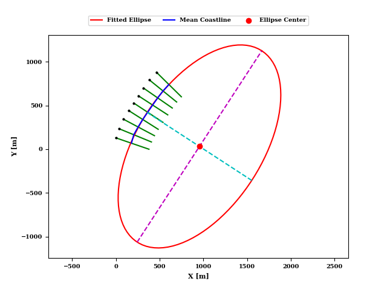

## IH-MOOSE model
### Model description
The IH-MOOSE model proposed by Jaramillo et al. 2021b [[1](https://doi.org/10.1016/j.coastaleng.2021.103983)] is an equilibrium-based shoreline evolution model (EBSEM) driven by incident wave energy/power and direction. It assumes the entire coastline has a parabolic planform and is applicable over time scales ranging from days to several years. Jaramillo et al. 2021b [[1](https://doi.org/10.1016/j.coastaleng.2021.103983)] proposed a simplified methodology for integrating cross-shore and rotational movements, assuming an equilibrium planform shape.

The original version integrated the cross-shore model of Yates et al. 2009 [[2](https://doi.org/10.1029/2009JC005359)], the rotation model of Jaramillo et al. 2021a [[3](https://doi.org/10.1016/j.coastaleng.2020.103789)], and the parabolic equilibrium planform expression of Hsu and Evans 1989 [[4](https://doi.org/10.1680/iicep.1989.3778)]. However, as presented in the manuscript, the proposed methodology is adaptable to assume any other EBSEM as a starting point to reproduce the cross-shore movement at the control profile located at the pivot point (which governs the rotation). It can incorporate any EBSEM for the rotational movement, followed by the equilibrium planform expression that best fits the embayed beach under study.

It should be noted that this reduced-complexity approach simulates the entire beach coastline evolution, whereas previous models required discretizing the beach into transects or sections to evaluate the entire embayed shoreline evolution, which resulted in a significant computational cost.

For more details on the IH-MOOSE framework and step-by-step implementation, see [the paper](https://doi.org/10.1016/j.coastaleng.2021.103983).

### Model implementation
IH-MOOSE was applied to **Task1.Short-term prediction** and **Task2.Medium-term prediction**. 
Its methodology involves analyzing initial data, defining an equilibrium beach planform, and calculating cross-shore and rotational movements to estimate shoreline evolution. Originally, a parabolic planform expression from Hsu and Evans 1989 was used, but due to unknown control points for beach X, this study simplified the shape to an elliptical segment: 

After defining the ellipse equation, the cross-shore movement is assessed using the EBSEM developed by Yates et al. 2009 for the control cross-shore profile (CCP). Subsequently, the rotational movement of the shoreline is estimated using the rotation model from Jaramillo et al. 2021. Lastly, the results from the rotation model determine the orientation of the homothetic planform series, with the pivot point being the shoreline position on the CCP for each time step.

### Modelers
:man_technologist: [Lucas de Freitas Pereira](https://ihcantabria.com/directorio-personal/lucas-de-freitas-pereira/) @ [ LinkedIn](https://www.linkedin.com/in/lucas-de-freitas-pereira-a64a0879/)
:man_technologist: [Camilo Jaramillo Cardona](https://ihcantabria.com/directorio-personal/camilo-jaramillo/) @ [ LinkedIn](https://www.linkedin.com/in/camilo-jaramillo-cardona-05b64789/)
### Contributor
:man_technologist: [Jose A. A. Antolinez](https://www.tudelft.nl/staff/j.a.a.antolinez/) @ [ LinkedIn](https://www.linkedin.com/in/jaaantolinez/)

### Model classification
#### Model mechanics
- [ ] Process-Based Models (PBM): couple hydrodynamics, waves, and morphodynamics through mass and momentum conservation laws.
- [x] Hybrid Models (HM): use observational data to calibrate free parameters in the equilibrium configuration of a system.
- [ ] Data-Driven Models (DDM): use observational data to train regression models (e.g. machine learning, statistical downscaling).
#### Model elements (multiple choices)
- [x] Cross-shore: model the shoreline position for each transect independently.
- [x] Long-shore: incorporate the interaction of shoreline position across different transects.
- [ ] Sea level: consider the impact of sea level rise on shoreline position.

### References
[[1](https://doi.org/10.1016/j.coastaleng.2021.103983)] Jaramillo, C., Martínez, J., González, M., Medina, R. (2021a), A shoreline evolution model for embayed beaches based on cross-shore, planform and rotation equilibrium models. *Coastal Engineering*, 169, 103983.\
[[2](https://doi.org/10.1029/2009JC005359)] Yates, M., Guza, R., O'Reilly, W. (2009), Equilibrium shoreline response: Observations and modeling, *J. Geophys. Res. Oceans.*\
[[3](https://doi.org/10.1016/j.coastaleng.2020.103789)] Jaramillo, C., González, M., Medina, R., Turki, I. (2021), An equilibrium-based shoreline rotation model. *Coastal Engineering*, 163, 103789.\
[[4](https://doi.org/10.1680/iicep.1989.3778)] Hsu, J., Evans, C. (1989), Parabolic bay shapes and applications, *Proceedings of the Institution of Civil Engineers.*, 87, pp. 1753-7789.
